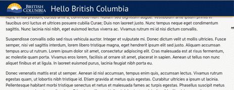

> Draft

# Navigation Bar – Basic
Navigation bars provide a list of links to important areas on a website or application. Typically, they are placed by the header. The B.C. government navigation bar provides a consistent look, feel, and functionality across government sites.

## Required

## Last Updated: 2 days ago

## Visual

## How to Use This:
* The Navigation Bar is the primary means of navigation around a website or application. Typically, it accommodates the top level of the information architecture.
* Use the basic navigation bar for sites with six (6) or fewer navigation links or pages; sites with more links or with a hierarchy of pages should consider using a more advanced navigation structure.
* List items that are relevant and most frequently used by the users of the website or service.
* Tip: Present items in order of the users priority – higher demand links should be placed further to the left while lower demand links should be placed further to the right.

## Don't Use This for:
* Websites or services that have a large number of items in the navigation menu. Horizontal navigation menus are designed for limited selections, consider using a side drop navigation.

## Rationale
The basic navigation menu is the current version and works closely with the Basic Header. It meets all government standards, branding, and accessibility requirements.

## Behaviour
1.	Items appear underlined on hover
2.	Items remain underlined and bolded when user is on the associated page
3.	The ‘hamburger icon’ should not appear on its own unless it has suitable Alternative text to ensure that It is recognizable by screen readers.”
4.	The menu should be full size on large screens and regular browsers. Smaller browers, including landscape tablets should use the collapsed version of the menu. The browser window is minimized to mobile view the navigation bar should appear as a hamburger dropdown menu.

## Accessibility
This navigation bar has been built according to WCAG 2.0 AA standards and has been successfully tested for the following:
1.	Perceivable
* Alternative text is provided for non-text content (WCAG 1.1.1)
* Content can be presented in different ways without losing information or structure (WCAG 1.3)
* Colour is not used as the only visual means of conveying information (WCAG 1.4.1)
* Visual presentation of text and images has a contrast ratio of at least 4.5:1 (WCAG 1.4.3)
* Text can be resized without assistive technology up to 200% without loss of content or functionality (WCAG 1.4.4)

2.	Operable
* All functionality of the content is operable through a keyboard interface (WCAG 2.1.1)
* A mechanism is available to bypass blocks of content that are repeated on multiple web pages (WCAG 2.4.1)
* Headings and Labels describe topic or purpose (WCAG 2.4.6)
* Any keyboard operable user interface has a mode of operation where the keyboard focus indicator is visible (WCAG  2.4.7)

3.	Understandable
* The default human language of each web page can be programmatically determined (WCAG 3.1.1)
* Navigational mechanisms that are repeated on multiple web pages occur in the same relative order each time they are repeated (WCAG 3.2.3)

4.	Robust
* For all user interface components, the name and role can be programmatically determined (WCAG 4.1.2)

## Design with This Component
Download and use the B.C. government Design System library to help build prototypes and wireframes for your website or application.

The library is constantly updated and currently available in the following tools:

* [Sketch](https://sketch.cloud/s/Q0bkG)

This library is updated on a regular basis; by subscribing to the design library, you’ll be informed of updates to components and new additions.

## Code
### HTML
  HTML goes here
### CSS
  HTML goes here
### Assets
  Assets go here

