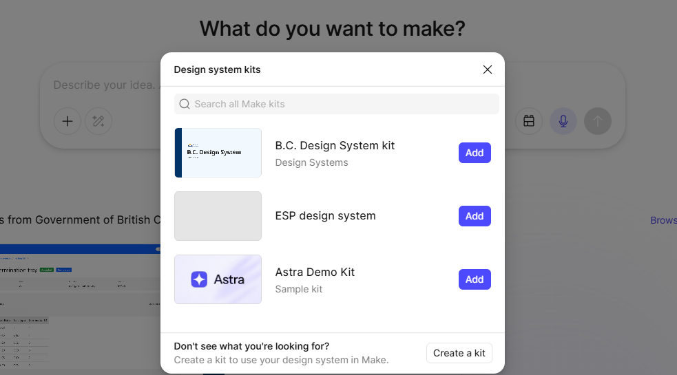

# Using Figma Make with the B.C. Design System

## Ways to use AI with the B.C. Design System

You can use AI with the B.C. Design System in Figma or in code. The Figma agent and Figma Make are both AI features of Figma.

|               | Figma agent (beta)                                 | Figma Make                                            | AI coding tools, like GitHub Copilot          |
| ------------- | -------------------------------------------------- | ----------------------------------------------------- | --------------------------------------------- |
| Works in      | Your Figma Design file                             | A separate Make file                                  | Your code editor                              |
| You get       | Editable screens built with library components     | A working prototype people can click through and test | Code built with B.C. Design System components |
| Design system | Connect the B.C. Design System library to the chat | Select the B.C. Design System Kit                     | Add our AI instruction files to your project  |

### Which one should you use?

- Want editable screens in your design file? Use the Figma agent.
- Want a prototype people can click through and test? Use Figma Make.
- Building in code? Use an AI coding tool with our AI instruction files.

## Getting started with Figma Make

### What is Figma Make?

Figma Make is an AI prompt-to-code tool built into Figma. It creates working HTML prototypes from written prompts. You describe what you want to create, and Figma Make generates a prototype that you can review, test and refine.

Figma Make is different from Figma AI features that help you work in a design file.

### Before you begin

Figma Make can help you create prototypes, but it cannot replace a designer. Take your time making the prompt and always review AI-generated content, layouts and interactions before sharing them with others.

Review every prototype for:

- Usability
- Accessibility
- Content quality
- Policy compliance
- Alignment with the B.C. Design System

### Quick start guidance

1. Open Figma and create a new **Make** file from the file options in the top-right corner.
2. In the prompt window, select the **Design System Kit** icon to open **Select a Design System Kit**.
3. Find **B.C. Design System Kit (Beta)** and select **Add**.
4. Use the [prompt guidance](#how-to-build-your-prompt) to write your prompt.
5. Press **Enter** to generate your prototype.
6. Review both the notes generated by Figma Make and the prototype itself. Request changes as needed and continue refining the prototype.
7. Before sharing your work, review it for usability, accessibility, content quality, policy compliance and alignment with the B.C. Design System.

## Using Figma Make

This guide helps you connect the Design System, write quality prompts and use fewer tokens.

- [How to use Figma Make with the Design System](#how-to-use-figma-make-with-the-design-system)
- [Who should use Figma Make](#who-should-use-figma-make)
- [Prompting Figma Make with the B.C. Design System](#prompting-figma-make-with-the-bc-design-system)
- [How to attach existing design examples](#how-to-attach-existing-design-examples)
- [Prompt tips](#prompt-tips)

If you have feedback on this guide or see anything missing or incorrect, contact [DesignSystem@gov.bc.ca](mailto:DesignSystem@gov.bc.ca).

## How to use Figma Make with the Design System

The B.C. Design System Kit helps Figma Make create webpage prototypes that use approved government components, styles and design patterns.

You can use Figma Make to:

- Create a prototype from an existing design
- Test ideas before investing in detailed design work
- Explore design concepts
- Learn how design system components work

The Design System team created the Design System Kit, which includes components, tokens and rules for the B.C. Design System. You need a full Figma licence to use it. The kit is in beta, and improvements to the agent files are ongoing.

### 1. Check if you have access

Open Figma files.

- If you see **Make** as a file type in the top-right corner, you have access to Figma Make.
- If you do not see **Make**, follow your ministry's access request process. Connected Services uses the My Service Centre support portal.

### 2. Create a Make file and add the Design System Kit

1. Select **Make** in the top-right corner of Figma.
2. In the chat window, select the **Select a Make Kit** icon in the bottom-right corner.

   

3. In **Select a Make Kit**, find **B.C. Design System Kit** and select **Add**.

   

4. Confirm that the B.C. Design System Kit appears in the bottom-left corner of the prompt window.

   

### 3. Write your first prompt

Take some time to use the [prompt guidance](#how-to-build-your-prompt) and [prompt tips](#prompt-tips) to create your prompt.

Add design files if they are relevant. Make will automatically use the Design System once the kit is attached to the prompt window.

### 4. Review your output

Review the prototype carefully, even if it looks correct. Ask other people to review it when appropriate. Check usability, accessibility and content quality, along with the other checks listed in [Before you begin](#before-you-begin).

### 5. Refine your design

Continue the conversation to refine the prototype instead of starting over. You can also select one element in the preview and ask Figma Make to change only that part. This uses fewer credits and gives you more control than regenerating the entire screen.

Plan each prompt before you send it because every prompt uses credits.

## Who should use Figma Make

This guide is for people who create, review, approve or maintain government web content using Figma Make and the B.C. Design System.

This includes:

- Designers who create layouts and prototypes
- Service owners who ensure products meet program and user needs and explore new feature ideas
- Program staff and subject matter experts who contribute content and review documents for accuracy
- Communications staff who support content quality, readability and consistency
- People who test prototypes with users or review them for accessibility

Follow B.C. government privacy and responsible AI guidance. Do not enter personal information, unreleased policy or other information that should not be public.

The Design System is still under development. Not all components and AI guidance are fully optimized, and the Design System team continues to improve this tool. Send feedback to [DesignSystem@gov.bc.ca](mailto:DesignSystem@gov.bc.ca).

## Prompting Figma Make with the B.C. Design System

A clear prompt and the Design System Kit will help reduce the time and credits needed to refine the output. Read the [prompt tips](#prompt-tips).

### How to build your prompt

Use these five parts (TC-EBC). One or two sentences for each part is enough.

- **Task:** What do you want to make? Name the page, form or flow, and say what it's for, like usability testing.
- **Context:** Who is it for? Describe the user and what they want to accomplish.
- **Elements:** What must people see and do? List the information, content and actions. You don't need to name components.
- **Behaviour:** How should it work? Explain steps, validation, navigation and what happens when users act.
- **Constraints:** What rules must it follow? Explain anything else it must or must not do, like no sign-in or one question per page.

### Example feedback constraints

- Identify missing information and list any assumptions made.
- If you need a detail I haven't given you, like a program name, fee, date, legal wording or phone number, don't make it up. Use a placeholder in square brackets instead.
- Ask questions before you start when requirements are unclear.
- Identify any components you built that are not part of the B.C. Design System.

### Example content constraints

If generating new content:

- Write in plain language. Follow the [B.C. government plain language checklist](https://www2.gov.bc.ca/gov/content/governments/services-for-government/service-experience-digital-delivery/web-content-development-guides/web-style-guide/writing-guide/plain-language).
- Use [B.C. government content writing standards](https://digital.gov.bc.ca/about/style-guide/). Use sentence case for headings.
- Meet WCAG 2.2 Level AA accessibility criteria.
- Don't add pages or features I haven't asked for.

## How to attach existing design examples

Start from an existing Figma design. Copy the frame in Figma and paste it into the Make prompt box. If the file isn't open, use **Add context > Designs > Attach**.

Don't paste a Figma link into your prompt. Make may read the link instead of the design.

Before you attach your design, check it has:

- One frame per screen, clearly named (for example, "1 Start")
- Auto Layout and no hidden layers
- B.C. Design System components, not detached copies
- No real personal information

In your prompt:

- Say how closely to follow it, like "Recreate closely" or "Use as a starting point"
- Describe how the screens connect
- For more than two screens, use plan mode

## Prompt tips

### Gather your materials beforehand

Gather your page content, project documents and any useful earlier prototypes before you begin. Give the AI the information it needs. Do not assume it can access information you have not provided. Include links to specific government standards when relevant.

### Focus on the user's goal

Explain the project objectives, user tasks and context instead of prescribing every visual detail.

Instead of:

> Put three cards below the heading.

Try:

> Help users compare the three options and choose the right one.

### Use Copilot to help write prompts

You can use Copilot to help build a prompt. Share the prompt recipe, explain your project and provide any supporting documentation. Mention that you have installed the Design System Kit and are using Figma Make. Draft the prompt outside Figma, then paste it into Figma Make.

### Avoid stopping and restarting prompts

If you stop a prompt to add new information, Figma Make may interpret the new instructions differently or treat them as conflicting. If important information is missing, start over with a more complete prompt.
